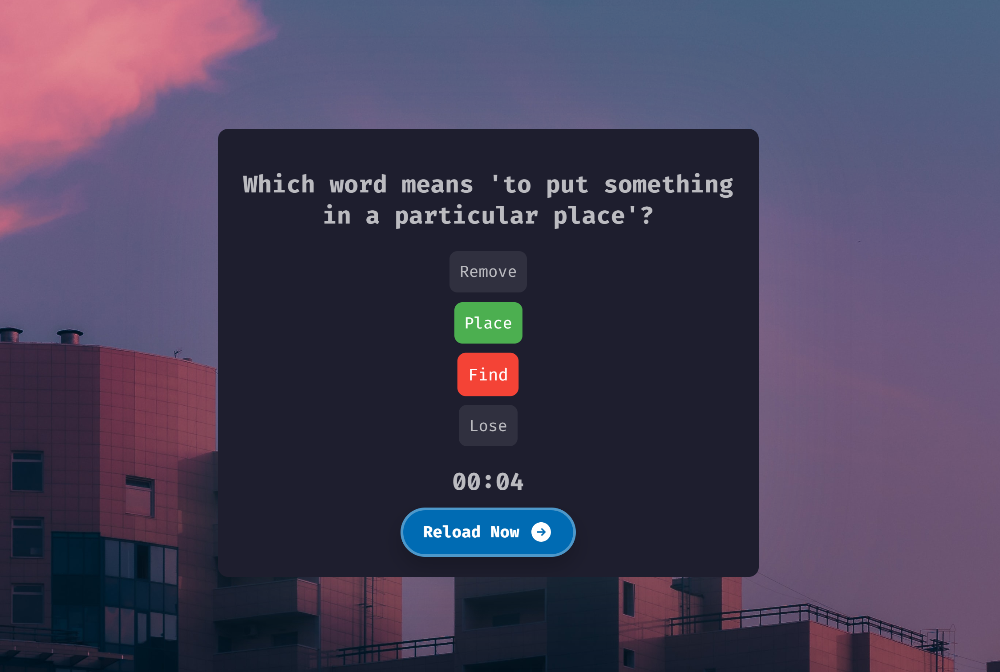
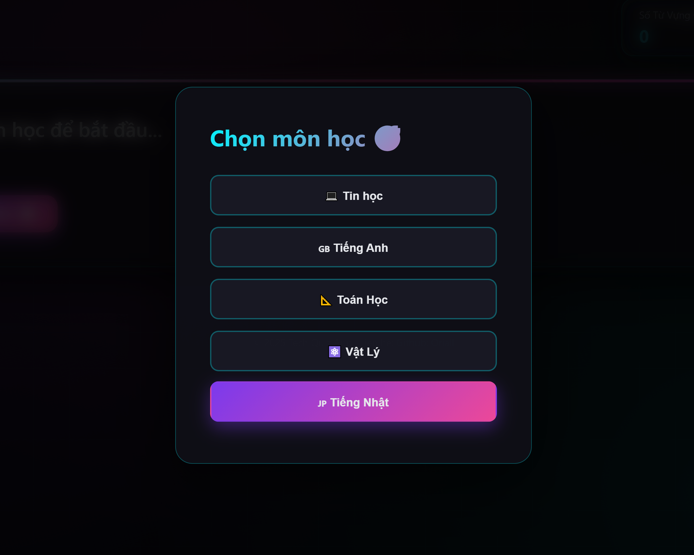

# 🎓 Multi-Subject Quiz App

Ứng dụng web nhỏ gọn giúp học sinh luyện tập **trắc nghiệm kiến thức** đa môn học (Tin học, Tiếng Anh, Toán, Vật lý) với nội dung câu hỏi được **tự động sinh bởi Gemini API** (AI từ Google).



---

## 🚀 Tính năng nổi bật

- ✅ Chọn môn học: Tin học, Tiếng Anh, Toán, Vật lý.
- ✅ Câu hỏi + 4 lựa chọn được AI tự động tạo.
- ✅ Đánh giá ngay: Đúng ✅ (màu xanh), Sai ❌ (màu đỏ).
- ✅ Hết thời gian sẽ tự hiển thị đáp án đúng.
- ✅ Thời gian trả lời linh hoạt theo từng môn:
  - ⏱ 5 giây với Tin học, Tiếng Anh.
  - ⏱ 1 phút với Toán, Vật lý.
- ✅ Giao diện sinh động với nền gif toàn màn hình.

---

## 🛠 Công nghệ sử dụng

| Công nghệ | Vai trò |
|----------|---------|
| `HTML5`  | Giao diện chính |
| `CSS3`   | Thiết kế responsive, thêm nền động |
| `JavaScript` | Logic, bộ đếm thời gian, gọi Gemini API |
| `Gemini API` (Google AI) | Sinh câu hỏi trắc nghiệm thông minh |

---

## 📂 Cấu trúc thư mục

```
/project-root
│
├── index.html          # Trang chính
├── style2.css          # CSS nền động + bố cục
├── script2.js          # Logic, đếm ngược, gọi API
├── img/
│   └── anh_minh_hoa.png  # Hình minh họa
```

---

## 🧠 Cách sử dụng

1. Truy cập giao diện.
2. Chọn môn học trong popup.
3. Hệ thống sinh câu hỏi tương ứng.
4. Người dùng chọn đáp án:
   - Nếu đúng ✅: chuyển màu xanh.
   - Nếu sai ❌: chuyển đỏ và hiển thị đáp án đúng.
5. Nếu hết thời gian: tự động tô đáp án đúng.
6. Nhấn “Reload Now” để nhận câu hỏi mới.

---

## 🔑 Hướng dẫn tích hợp API Gemini

1. Truy cập [https://makersuite.google.com/app](https://makersuite.google.com/app) để tạo API key.
2. Mở file `script2.js`, tìm dòng:

```js
fetch("https://generativelanguage.googleapis.com/v1beta/models/gemini-2.0-flash:generateContent?key=YOUR_KEY", {
```

3. Thay `YOUR_KEY` bằng API Key của bạn.

---

## 🖼 Hình ảnh minh họa

| Chọn môn học | Câu hỏi xuất hiện |
|-------------|------------------|
|  |  |

---

## 📥 Cài đặt & chạy thử

```bash
# Clone dự án về máy
git clone https://github.com/Oriall/Quiz_StudyZone.git

# Mở file index.html trên trình duyệt bất kỳ
```

> ⚠️ API yêu cầu kết nối mạng và API key hợp lệ từ Google.

---

## 📩 Liên hệ

- **Tác giả**: Oriall
- **Email**: [vokhanhtoannghithu@gmail.com](mailto:vokhanhtoannghithu@gmail.com)
- **GitHub**: [github.com/oriall](https://github.com/oriall)

---

© 2025 Multi-Subject Quiz App. All rights reserved.
