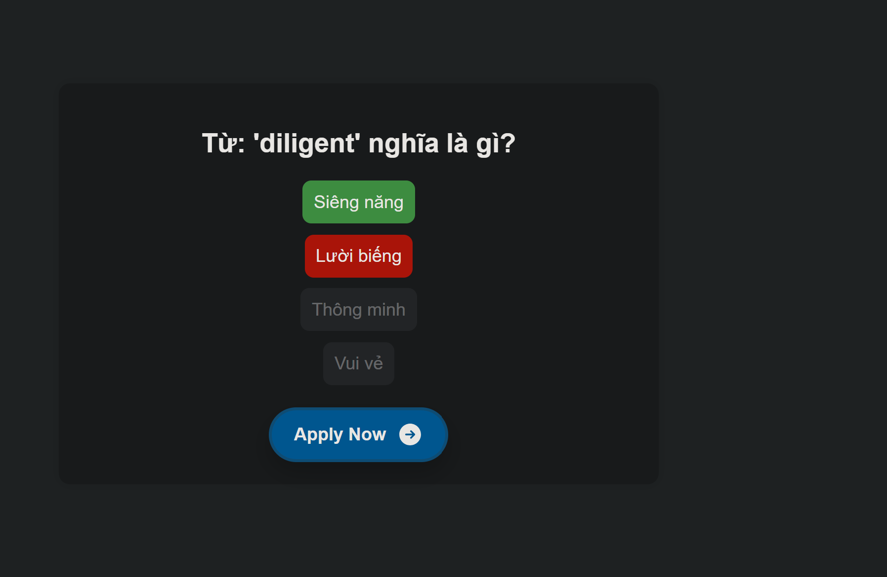

# 📚 Vocabulary Quiz App

Một ứng dụng web nhỏ gọn giúp người học Tin Học luyện tập kiến thức theo dạng **trắc nghiệm**, với dữ liệu sinh động được **tự động tạo từ Gemini API** (AI của Google).



---

## 🚀 Tính năng

- ✅ Tự động sinh câu hỏi kiến thức Tin Học kèm 4 lựa chọn.
- ✅ Người dùng chọn đáp án bằng button.
- ✅ Đúng => xanh 🍀 | Sai => đỏ ❌, hiện đáp án đúng.
- ✅ Giao diện đơn giản, dễ dùng, hỗ trợ trên mọi thiết bị.

---

## 🛠 Công nghệ sử dụng

| Công nghệ | Mô tả |
|----------|-------|
| `HTML5`  | Cấu trúc trang |
| `CSS3`   | Giao diện đẹp, phản hồi nhanh |
| `JavaScript` | Xử lý logic, gọi API |
| `Gemini API` (Google AI) | Sinh nội dung câu hỏi thông minh |

---

## 📂 Cấu trúc thư mục

```
/project-root
│
├── index.html          # Giao diện chính
├── style2.css          # File CSS
├── script2.js          # Logic và gọi API
├── img/
│   └── demo-preview.png # Hình ảnh minh họa
```

---

## 🧠 Cách hoạt động

1. Nhấn **"Next Question"** để gọi API Gemini tạo một câu hỏi.
2. Hệ thống hiển thị kiến thức và 4 nghĩa tiếng Việt.
3. Người dùng chọn đáp án:
   - Nếu đúng: nút chuyển màu **xanh**.
   - Nếu sai: nút sai chuyển **đỏ**, nút đúng chuyển **xanh**.
4. Nhấn lại nút để tiếp tục câu hỏi mới.

---

## 🔑 Hướng dẫn tích hợp API Gemini

1. Truy cập [https://makersuite.google.com/app](https://makersuite.google.com/app) và đăng nhập.
2. Tạo API Key mới.
3. Thay dòng sau trong `script2.js`:

```js
fetch("https://generativelanguage.googleapis.com/v1beta/models/gemini-pro:generateContent?key=999999", {
```

👉 bằng:

```js
fetch("https://generativelanguage.googleapis.com/v1beta/models/gemini-pro:generateContent?key=YOUR_API_KEY", {
```

---

## 🖼 Hình ảnh minh họa

| Trang chính | Sau khi chọn sai |
|-------------|------------------|
|  | |

---

## 📥 Cài đặt và chạy (local)

```bash
# 1. Tải về source code
git clone https://github.com/Oriall/Quiz_StudyZone.git

# 2. Mở file index.html bằng trình duyệt
```

> 🔒 Lưu ý: API chỉ hoạt động nếu key còn hiệu lực và được cấp phép.

---

## 📩 Liên hệ

- Tác giả: **Oriall**
- Email: [vokhanhtoannghithu@gmail.com](mailto:vokhanhtoannghithu@gmail.com)
- GitHub: [github.com/oriall](https://github.com/Oriall)

---

© 2025 Vocabulary Quiz App. All rights reserved.
