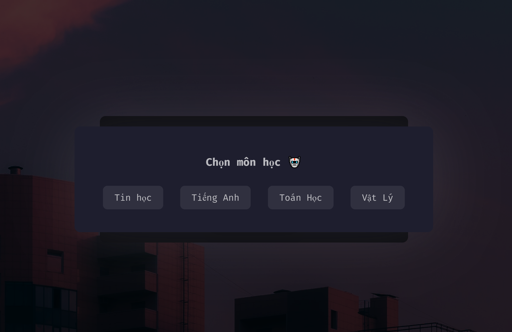

# Multi-Subject Quiz Platform
> ### An AI-powered educational platform with intelligent question generation and global leaderboard system

> [!IMPORTANT]
> This project was created for educational and learning purposes with major updates including Gemini AI API integration for automated question generation, support for 5 subjects (Computer Science, English, Mathematics, Physics, Japanese), dual question formats (multiple-choice and essay-based), real-time streak tracking with milestone achievements, and global leaderboard system with cloud synchronization.

---

## Introduction

**Multi-Subject Quiz Platform** is an interactive web-based learning application designed to help students practice and improve their knowledge across multiple subjects through AI-generated questions and competitive learning features. The system leverages Google's Gemini AI to generate contextually relevant questions for Computer Science, English, Mathematics, and Physics, while utilizing a curated database of 99 vocabulary words for Japanese language learning from Minna no Nihongo textbook lessons 1-4.

Students can experience two distinct question formats including multiple-choice questions with four options and essay-based questions requiring Hiragana input for Japanese vocabulary, receiving immediate feedback with detailed AI-generated explanations after each answer. The platform features a comprehensive scoring system with streak tracking that counts consecutive correct answers across all questions, resetting to zero on incorrect answers or timeouts, with automatic data persistence at milestone achievements of 5, 10, 15, 20 streak intervals.

A global leaderboard system ranks players based on their highest streak achievements with real-time synchronization across all users through JSONBin.io cloud storage, displaying top 10 players with medal indicators for the first three positions and highlighting the current player's entry in yellow for easy identification.


---

## Core Features

### For Students

Students can access practice questions across 5 different subjects with varying difficulty levels and time limits, experiencing two distinct question formats where multiple-choice questions present four options for selection while essay-based questions require manual text input of Hiragana characters for Japanese vocabulary. The system provides immediate feedback upon answer submission with correct answers highlighted in green and incorrect answers shown in red while displaying the correct answer, followed by detailed AI-generated explanations in modal popups that help students understand the reasoning behind each answer.

Progress tracking features include a streak counter that increments with each consecutive correct answer and displays current score at the top of the interface, while achievement milestones appear at significant streak values (5, 10, 15, 20, 50, 100+) with celebratory notifications encouraging continued learning. Students can compete globally on the leaderboard by clicking the button in the bottom-right corner to view rankings, check their position among all players, and see their name highlighted for easy identification with real-time updates reflecting changes from all active users.

The intelligent caching system prevents question repetition by storing the last 50 questions per subject in browser LocalStorage, automatically checking new questions against the cache before display with up to 3 regeneration attempts if duplicates are detected, ensuring a varied learning experience without encountering the same question within a short timeframe.

### Question Generation System

The platform employs Google's Gemini AI API to generate unique questions for Computer Science, English, Mathematics, and Physics subjects with each request specifying the subject matter, difficulty level, and required format while requesting four answer options with one correct choice and a detailed explanation. Japanese language questions utilize a pre-loaded database from data.txt containing 99 vocabulary entries from Minna no Nihongo lessons 1-4, with each entry including Hiragana pronunciation, Kanji characters when applicable, and Vietnamese translations, alternating randomly between multiple-choice and essay formats to test both recognition and recall abilities.

Questions are generated with subject-specific time limits ranging from 10 seconds for quick-response subjects like Computer Science and English to 60 seconds for subjects requiring more calculation time like Mathematics and Physics, with Japanese essay questions allowing 30 seconds for typing Hiragana while multiple-choice Japanese questions allow 60 seconds. The caching mechanism stores generated questions in LocalStorage with separate cache arrays for each subject, checking each new question against the last 50 questions to prevent repetition within the same session, automatically clearing old cache entries when the 50-question limit is reached, and implementing a fallback system that displays a cached question if three consecutive generation attempts produce duplicates.

### Leaderboard System

The global leaderboard maintains a ranking of all players based on their highest achieved streak count, with data stored on JSONBin.io cloud storage enabling real-time synchronization across all users and devices without requiring authentication or user accounts. Rankings are calculated by sorting players in descending order of their maximum streak value, with ties broken by timestamp where earlier achievements rank higher, and the top 10 players displayed in the leaderboard modal with medal emojis for first, second, and third positions.

Automatic save operations trigger at multiple points including every 5 streak increments (5, 10, 15, 20, and so on), when streak resets due to incorrect answer or timeout, and when the user closes or navigates away from the page through the beforeunload event listener, with a 2-second cooldown between consecutive save operations to prevent API rate limiting. The leaderboard modal can be opened by clicking the dedicated button in the bottom-right corner of the interface, displaying player names with their highest streaks and timestamps, highlighting the current player's entry with a yellow background for easy identification, and providing a close button to return to the quiz interface.

Manual save functionality is available through the save button in the bottom-left corner, allowing players to immediately persist their current streak to the leaderboard before closing the browser or switching devices, with confirmation feedback displayed upon successful save completion.

---

# Setup

## Prerequisites

Before running the application, you must have a modern web browser supporting ES6+ JavaScript (Chrome 90+, Firefox 88+, Safari 14+, or Edge 90+), an active internet connection for API functionality, a Gemini API key obtained from Google AI Studio at https://makersuite.google.com/app/apikey, and a JSONBin.io account with API credentials created at https://jsonbin.io for leaderboard data storage.

---

> [!CAUTION]
> Before running the application, ensure you have configured your Gemini API key in the main script file, set up JSONBin.io credentials for leaderboard functionality, verified internet connectivity for API requests, and reviewed browser compatibility requirements.

## Installation Steps

### 1. Clone the repository
```bash
git clone https://github.com/Oriall/Quiz_StudyZone.git
cd Quiz_StudyZone
```

### 2. Configure Gemini API Key
Open `script.js` and locate the fetch request URL, then replace `YOUR_KEY` with your Gemini API key:
```javascript
fetch("https://generativelanguage.googleapis.com/v1beta/models/gemini-2.0-flash:generateContent?key=YOUR_KEY", {
```

### 3. Configure JSONBin.io Credentials
Open `leaderboard.js` and update the configuration object with your bin ID and access key:
```javascript
const JSONBIN_CONFIG = {
  binId: "YOUR_BIN_ID_HERE",
  accessKey: "YOUR_ACCESS_KEY_HERE",
  masterKey: "YOUR_ACCESS_KEY_HERE"
};
```

To create a JSONBin collection, log into your JSONBin.io account and click "Create Bin", name it "quiz-leaderboard", initialize it with the JSON structure `{"players": []}`, save the bin and copy the bin ID from the URL, then navigate to your profile settings to copy the API access key which will be used for both accessKey and masterKey fields.

### 4. Launch the application
Open `index.html` in your web browser by double-clicking the file or dragging it into a browser window, or for production deployment use a web server like Python's `python -m http.server 8000` or Node.js's `npx http-server -p 8000` to serve the files locally.

### 5. Access the application
The application will run directly in your browser at `file:///path/to/Quiz_StudyZone/index.html` for local access, or `http://localhost:8000` if using a local web server.

---

## Project Structure

```
Quiz_StudyZone/
├── index.html                 # Main application entry point
├── style.css                  # Application stylesheet with animations
├── script.js                  # Core game logic and question generation
├── leaderboard.js            # Leaderboard management and API integration
├── data.txt                  # Japanese vocabulary database (99 entries)
├── README.md                 # Project documentation
└── img/
    ├── minhhoa2.png          # Application preview image
    ├── chon_mon.png          # Subject selection screenshot
    ├── name_input.png        # User name input interface
    └── essay_mode.png        # Essay question format example
```

---

## Technology Stack

### Frontend Technologies
The application is built with HTML5 for semantic markup and structure, CSS3 for modern styling including animations, gradients, and responsive design using Grid and Flexbox layouts, and Vanilla JavaScript (ES6+) for all client-side application logic without any frameworks or libraries. LocalStorage API is utilized for question caching and session management to prevent question repetition and maintain user progress across browser sessions.

### External Services
Google Gemini API provides AI-powered question and explanation generation for four subjects with natural language processing capabilities, while JSONBin.io serves as a cloud-based JSON storage solution for the global leaderboard data enabling real-time synchronization across all users without requiring backend infrastructure. Font Awesome icon library enhances the user interface with scalable vector icons for buttons, medals, and other UI elements.

### Design Principles
The interface implements responsive layout principles using CSS Grid for the main structure and Flexbox for component-level layouts, ensuring compatibility across desktop and mobile devices. Smooth animations and transitions are achieved through CSS keyframes and transform properties with GPU acceleration for optimal performance, while gradient backgrounds create visual depth with dynamic effects. Modal-based user interactions provide focused feedback for answer explanations and leaderboard display without disrupting the main quiz flow.

---

## Supported Subjects

### Computer Science (Grade 12)
Topics include Database Management Systems, Python Programming, C++ Programming, HTML and Web Development, and Computer Networks with questions covering both theoretical concepts and practical programming scenarios. Questions are presented in multiple-choice format with four options, a time limit of 10 seconds per question encouraging quick recall and decision-making, and AI-generated explanations that break down the reasoning behind correct answers while clarifying common misconceptions.

### English Language
Vocabulary questions are organized by thematic categories including common phrases, idiomatic expressions, grammar rules, and usage patterns with emphasis on practical communication skills. The format includes multiple-choice questions with four options testing word recognition and contextual understanding, a 10-second time limit for rapid response, and detailed explanations providing word definitions, usage examples, and related vocabulary.

### Mathematics (Grade 12)
Content is aligned with Vietnamese curriculum 2018 covering Calculus and Analysis topics such as derivatives, integrals, and limits, Algebra and Geometry including equations, functions, and spatial reasoning, and Probability and Statistics with problems involving distributions, expected values, and data analysis. Questions are presented as multiple-choice with four options, a generous 60-second time limit allowing for calculation and problem-solving, and comprehensive explanations showing step-by-step solution methods with mathematical reasoning.

### Physics (Grade 12)
Topics encompass Mechanics and Kinematics with problems on motion, forces, and energy, Thermodynamics covering heat transfer, entropy, and thermodynamic cycles, Electromagnetism including electric fields, magnetic fields, and electromagnetic induction, and Wave and Optics dealing with wave properties, interference, and refraction. The multiple-choice format with four options is paired with a 60-second time limit for problem analysis and calculation, while explanations include formula derivations, unit conversions, and conceptual clarifications.

### Japanese Language (Beginner Level)
Vocabulary content is sourced from Minna no Nihongo textbook lessons 1-4, comprising 99 curated vocabulary entries including common nouns, verbs, adjectives, pronouns, and particles essential for basic communication. Questions alternate randomly between multiple-choice format testing recognition skills with four options and 60-second time limit, and essay format requiring manual Hiragana input to test recall and writing skills with a 30-second time limit. Each entry includes Hiragana pronunciation for phonetic accuracy, Kanji characters when applicable showing standard written forms, and Vietnamese translations providing clear meaning in the student's native language.

---

## Scoring System

### Point Mechanics
The scoring system awards +1 point for each correct answer regardless of subject or question format, while incorrect answers result in no point deduction allowing students to learn from mistakes without penalty. Timeout situations where the timer reaches zero before an answer is submitted are treated as incorrect answers, resetting the streak counter but not removing any previously earned points. The total score accumulates throughout the session and persists in the interface header, providing continuous feedback on overall performance across all subjects and question types.

### Streak System
The streak counter tracks consecutive correct answers across all questions regardless of subject changes, increasing by 1 for each correct answer and displaying the current value prominently in the interface header. The counter resets to 0 immediately upon any incorrect answer or timeout event, creating a challenging goal for students to maintain focus and accuracy over extended periods. The highest streak achieved during the session is recorded for leaderboard ranking purposes, with automatic saves triggered at milestone intervals to preserve significant achievements even if the streak is later broken.

### Milestone Achievements
Special celebratory notifications appear automatically when the streak counter reaches significant milestone values, providing positive reinforcement and encouraging continued engagement. Achievement messages are displayed in modal overlays with distinct styling and animations, remaining visible for several seconds before auto-closing to allow students to briefly celebrate before continuing.

| Streak Value | Achievement Message |
|--------------|---------------------|
| 5 | "Streak x5! You're doing great!" |
| 10 | "Streak x10! Excellent performance!" |
| 15 | "Streak x15! You're on fire!" |
| 20 | "Streak x20! Master level!" |
| 50 | "Streak x50! Unbelievable achievement!" |
| 100+ | "Streak x100+! Legendary status!" |


---

## User Interface Guide

### Initial Setup
When first accessing the application, users are prompted to enter a display name with a maximum length of 20 characters, which will be visible on the global leaderboard and used to identify their achievements. The entered name is stored in browser LocalStorage and persists across sessions, eliminating the need to re-enter the name on subsequent visits unless the browser cache is cleared.


### Subject Selection
After entering a name, users can click on any of the five subject cards displayed on the screen, each showing a distinct icon and subject name for easy identification. Clicking a subject card immediately triggers the question generation process, with loading indicators displayed while the API request is processed, and the subject can be changed at any time during gameplay by returning to the subject selection screen through the navigation controls.



### Multiple-Choice Questions
Question text is displayed prominently at the top of the quiz interface with four answer options presented as clickable buttons below, each labeled with letters A through D for clear identification. When an answer is clicked, the system immediately evaluates the response and provides visual feedback by changing the clicked button to green if correct or red if incorrect, with the correct answer button highlighted in green regardless of which option was selected. An explanation modal appears automatically after answer submission, containing detailed reasoning about why the correct answer is right and often explaining why other options are incorrect, with a close button to dismiss the modal and continue to the next question.


### Essay Questions (Japanese Language)
For essay-format Japanese questions, the vocabulary prompt is displayed at the top showing the Kanji or Vietnamese meaning, with a text input field below accepting Hiragana character input from the user's keyboard. Users can type their answer using Japanese IME (Input Method Editor) or any Hiragana input method available on their system, then press Enter or click the Submit button to evaluate their response. Correct answers cause the input field to turn green with positive feedback, while incorrect answers display the correct Hiragana below the input field in red text with the explanation modal providing additional context about the word's usage and meaning.


### Timer Functionality
A countdown timer displays in the top-right corner of the quiz interface, showing remaining seconds with color changes as time decreases (green for plenty of time, yellow for moderate time remaining, red for final seconds). The timer automatically pauses when explanation modals are displayed to prevent frustration from losing time while reading feedback, and resumes when the modal is closed. When the timer reaches zero before an answer is submitted, the system automatically treats it as an incorrect answer, displays the correct answer with explanation, resets the streak counter, and proceeds to the next question after the modal is dismissed.

### Leaderboard Access
The leaderboard button located in the bottom-right corner of the interface opens a modal overlay displaying the top 10 players globally, with each entry showing the player's name, highest streak value, and timestamp of achievement. Medal icons appear next to the first three positions with gold for first place, silver for second, and bronze for third, while the current player's entry is highlighted with a yellow background regardless of their ranking position for easy identification. The modal includes a close button to return to the quiz interface, and the leaderboard data automatically refreshes from the cloud database each time the modal is opened to ensure up-to-date rankings.


### Manual Save Functionality
The save button located in the bottom-left corner of the interface allows players to manually trigger a save operation, immediately persisting their current streak value to the cloud leaderboard database. This feature is particularly useful before closing the browser or switching devices, as it ensures the current progress is recorded even if an automatic save hasn't been triggered yet. Upon successful save completion, a confirmation message appears briefly to inform the user that their data has been successfully uploaded to the leaderboard.

---

## API Documentation

### Gemini AI Integration

The application communicates with Google's Gemini AI through POST requests to the generativelanguage.googleapis.com endpoint, sending prompts that specify the desired subject, question format, and requirements in natural language. Each request includes the API key as a URL parameter and a JSON payload containing the prompt text structured to request a multiple-choice question with four options, the correct answer indicated by letter, and a detailed explanation of the reasoning.

#### Question Generation Request
```http
POST https://generativelanguage.googleapis.com/v1beta/models/gemini-2.0-flash:generateContent?key={API_KEY}
Content-Type: application/json

{
  "contents": [{
    "parts": [{
      "text": "Generate a Computer Science question about databases with 4 options (A, B, C, D). Format: Question: [text]\nA) [option]\nB) [option]\nC) [option]\nD) [option]\nCorrect Answer: [letter]\nExplanation: [detailed reasoning]"
    }]
  }]
}
```

#### Expected Response Format
```json
{
  "candidates": [{
    "content": {
      "parts": [{
        "text": "Question: What is normalization in databases?\nA) A process to reduce data redundancy\nB) A method to increase storage\nC) A technique for data encryption\nD) A way to backup data\nCorrect Answer: A\nExplanation: Normalization is the process of organizing data in a database to reduce redundancy and improve data integrity by dividing tables into smaller tables and defining relationships between them."
      }]
    }
  }]
}
```

### JSONBin.io Integration

The leaderboard system interacts with JSONBin.io's REST API using standard HTTP methods, with GET requests to fetch current leaderboard data and PUT requests to update the data with new player entries or modified streak values. All requests include the X-Access-Key header for authentication and the X-Master-Key header for write operations, with the bin ID specified in the URL path.

#### Fetch Leaderboard
```http
GET https://api.jsonbin.io/v3/b/{BIN_ID}/latest
X-Access-Key: {ACCESS_KEY}
```

#### Update Leaderboard
```http
PUT https://api.jsonbin.io/v3/b/{BIN_ID}
Content-Type: application/json
X-Master-Key: {MASTER_KEY}

{
  "players": [
    {
      "name": "StudentName",
      "streak": 25,
      "timestamp": "2025-01-15T10:30:00.000Z"
    }
  ]
}
```

---

## Question Caching System

### Cache Mechanism

The application implements an intelligent caching system to prevent repetitive questions and enhance the learning experience by storing the last 50 questions per subject in browser LocalStorage. When a new question is generated by the Gemini API or selected from the Japanese vocabulary database, the system compares it against the cached questions to detect duplicates before displaying it to the user. If a duplicate is detected, the system automatically requests a new question from the API with up to 3 regeneration attempts, and if all attempts result in duplicates or the API fails, it falls back to displaying a cached question that hasn't been shown recently.

Cache storage is organized with separate LocalStorage keys for each subject (computerScience_cache, english_cache, mathematics_cache, physics_cache, japanese_used), with array values containing question text or vocabulary indices. The cache automatically maintains a maximum size of 50 entries per subject using a first-in-first-out (FIFO) approach, removing the oldest entry when adding a new one that would exceed the limit. Japanese vocabulary tracking uses a different approach, storing indices of used questions rather than full question text to optimize storage space given the limited vocabulary database size.

### Cache Management

```javascript
// Cache structure in LocalStorage
{
  "computerScience_cache": [
    "What is a primary key in database design?",
    "Which data structure uses LIFO principle?",
    // ... up to 50 questions
  ],
  "english_cache": [
    "Choose the correct synonym for 'abundant':",
    "Which phrase is grammatically correct?",
    // ... up to 50 questions
  ],
  "japanese_used": [1, 5, 12, 23, 45, 67, 89] // indices of used vocabulary
}
```

Cache validation occurs before every question display, with the system checking if the newly generated question text already exists in the subject-specific cache array. For Japanese vocabulary, the system checks if the randomly selected vocabulary index is in the japanese_used array, and if so, continues selecting random indices until finding an unused one or all 99 entries have been used. When all vocabulary entries have been used, the japanese_used array is automatically cleared to reset the cycle and allow questions to repeat without maintaining an infinitely growing cache.

---

## Deployment Options

### GitHub Pages Deployment

GitHub Pages provides free static hosting directly from a repository, making it ideal for client-side applications like this quiz platform. To deploy, first fork or push the repository to your GitHub account, then navigate to the repository settings and scroll to the Pages section. Configure the deployment source by selecting "Deploy from a branch" and choosing the main branch with the root folder, then click Save to trigger the initial deployment. GitHub will build and deploy your site within a few minutes, making it accessible at `https://yourusername.github.io/Quiz_StudyZone` where yourusername is your GitHub username.

### Netlify Deployment

Netlify offers continuous deployment with automatic builds and SSL certificates through a simple drag-and-drop interface or Git integration. Sign up for a free account at netlify.com, then click "Add new site" and select "Import an existing project" if deploying from Git or "Deploy manually" if uploading files directly. Connect your GitHub repository if using Git integration, configure build settings by leaving the build command empty since this is a static site and setting the publish directory to the root folder, then click Deploy. Netlify will assign a random subdomain like `random-name-12345.netlify.app` which can be customized to a custom domain through the site settings.

### Vercel Deployment

Vercel specializes in frontend deployment with automatic Git integration and preview deployments for every commit. Install the Vercel CLI globally with `npm install -g vercel`, navigate to the project directory in your terminal, then run `vercel` and follow the interactive prompts to configure your deployment. The CLI will ask for project confirmation, deployment settings, and whether to link to an existing project, then automatically deploy your application and provide a live URL. Subsequent deployments can be triggered with `vercel --prod` for production or automatically through Git commits if linked to a repository.

### Local Development Server

For development and testing purposes, running a local web server is recommended over opening HTML files directly due to CORS policies and module loading restrictions. Python 3 users can start a simple HTTP server with `python -m http.server 8000`, which serves the current directory contents on port 8000 accessible at `http://localhost:8000`. Node.js users can use the http-server package by running `npx http-server -p 8000` without requiring a global installation, which provides similar functionality with additional features like gzip compression and CORS support.

> [!NOTE]
> All deployment options require valid API keys configured in the source files before deployment. GitHub Pages and static hosting services work perfectly for this client-side application as no server-side processing is required. Remember to never commit your actual API keys to public repositories; consider using environment variables or secret management for production deployments.

---

## Troubleshooting

### Questions Not Loading

When questions fail to generate or display, first verify that your Gemini API key is correctly configured in script.js by checking the fetch URL contains a valid key without extra spaces or characters. Open the browser console (F12 → Console tab) to inspect error messages which typically indicate API authentication failures, network connectivity issues, or malformed request payloads. Check your internet connection is stable and not blocking API requests through firewalls or corporate proxies, and verify you haven't exceeded your Gemini API quota limits by logging into Google AI Studio and checking usage metrics. If CORS errors appear in the console, ensure you're accessing the application through a proper web server rather than the file:// protocol, as some browsers restrict API calls from local files for security reasons.

### Leaderboard Not Updating

Leaderboard issues typically stem from incorrect JSONBin.io configuration or network problems during save operations. Verify your bin ID and access keys are correctly entered in leaderboard.js by comparing them character-by-character with the values from your JSONBin dashboard, ensuring no extra quotes, spaces, or special characters were accidentally included. Check the browser console for error responses from the JSONBin API, which may indicate authentication failures (401 status), missing permissions (403 status), or invalid bin IDs (404 status). Manually test the API by visiting your JSONBin dashboard and verifying the bin exists and contains valid JSON data with the expected players array structure, and confirm your API key has both read and write permissions enabled in the key settings.

### Streak Not Saving

Streak persistence failures often relate to browser storage restrictions or incorrect player name configuration. Ensure you entered a player name when prompted, as the save system requires a valid name to create leaderboard entries, and verify the name is stored in LocalStorage by opening DevTools → Application → LocalStorage and checking for the playerName key. Check that LocalStorage is enabled in your browser and not blocked by privacy extensions like Privacy Badger or uBlock Origin, which may prevent websites from using storage APIs. Review the browser console for save operation logs that should appear every time an automatic save triggers, indicating whether the save succeeded or failed with specific error messages. Test the manual save button in the bottom-left corner to force a save operation and observe any console output or error messages that appear.

### Timer Not Working Correctly

Timer malfunctions can result from JavaScript errors, browser performance issues, or incorrect implementation. Open the browser console and look for JavaScript errors that may be preventing timer initialization or update functions from executing properly, particularly errors in the timing or rendering code. Verify no browser extensions are interfering with JavaScript execution by testing the application in an incognito/private window with extensions disabled. Clear your browser cache completely and perform a hard refresh (Ctrl+Shift+R or Cmd+Shift+R) to ensure you're running the latest version of all scripts without cached older versions. Test in a different browser to rule out browser-specific bugs, and ensure your system time is correct as some timing functions may rely on system clock accuracy.

### Japanese Input Not Accepting Hiragana

Hiragana input problems usually involve input method configuration on the user's operating system rather than application bugs. Enable Japanese input method on your system by accessing language settings (Windows: Settings → Time & Language → Language, Mac: System Preferences → Keyboard → Input Sources, Linux: varies by distribution) and adding Japanese as an input language. Switch your keyboard to Hiragana mode using the IME toolbar or keyboard shortcut (typically Alt+~ on Windows, Ctrl+Space on Mac) which changes the input method from Direct Input to Hiragana. If you cannot configure Japanese input, use an online Hiragana keyboard website or copy-paste Hiragana characters from a reference page as a workaround. Check browser language settings to ensure Japanese character support is enabled, and verify the input field accepts Unicode text by testing with copy-pasted Hiragana from a known source.

### API Quota Exceeded

Rate limiting errors occur when you've exceeded the free tier limits of the Gemini API, typically 60 requests per minute or daily quotas depending on your account type. Wait for the quota to reset, which usually happens at midnight UTC for daily limits or after one minute for per-minute limits, with error responses typically indicating when you can retry. Create a new Gemini API key from Google AI Studio if the current key has exhausted its quota and you need immediate access, though this only works if the quota is per-key rather than per-account. Implement request throttling in the code by adding delays between consecutive API calls, particularly during rapid question navigation, to avoid hitting rate limits during normal usage. Consider upgrading to a paid API plan if you're consistently hitting quota limits, which provides higher rate limits and daily allowances suitable for heavy usage or production deployments.

---

## Browser Compatibility

### Supported Browsers

The application requires modern browsers with full ES6+ support, CSS Grid and Flexbox capabilities, and standards-compliant implementations of LocalStorage and Fetch APIs. Chrome version 90 and higher provides full support for all features including smooth animations and optimal performance with the V8 JavaScript engine. Firefox version 88 and higher offers complete compatibility with excellent developer tools for debugging, though some animation performance may vary compared to Chrome. Safari version 14 and higher on both macOS and iOS supports all required features, though older versions may experience minor animation glitches or timing inconsistencies. Edge version 90 and higher, based on Chromium, provides identical compatibility to Chrome with full feature support. Opera version 76 and higher, also Chromium-based, works perfectly with the application and offers additional features like built-in VPN for privacy.

### Required Features

ES6+ JavaScript support is essential for arrow functions, template literals, async/await syntax, destructuring, and spread operators used throughout the codebase. CSS Grid and Flexbox are required for responsive layout implementation, with Grid handling main page structure and Flexbox managing component-level layouts for subject cards and modal dialogs. LocalStorage API must be available and functional for question caching and player name persistence, with a minimum of 5MB storage quota to accommodate multiple subject caches. Fetch API is required for all HTTP requests to Gemini AI and JSONBin.io, replacing older XMLHttpRequest patterns with Promise-based syntax. Promises and async/await syntax are used extensively for API calls and asynchronous operations throughout the application logic. CSS Animations and Transitions must be supported for smooth visual feedback, modal appearances, and button hover effects that enhance user experience.

### Known Issues

Internet Explorer is completely unsupported due to lack of ES6 support, missing Fetch API implementation, and incompatible CSS features requiring polyfills that would significantly increase codebase complexity. Older Safari versions (13 and below) may experience animation glitches particularly with complex gradient backgrounds and transform animations, though core functionality remains intact. Mobile browsers on iOS and Android provide full touch event support with tap, swipe, and scroll gestures working as expected, though keyboard input for Japanese text requires proper IME configuration on the device. Opera Mini in Extreme mode may have limited JavaScript functionality due to server-side rendering which can affect real-time features and API calls.

---

## License

This project is licensed under the MIT License, granting users the freedom to use, modify, and distribute the software in both personal and commercial contexts with minimal restrictions.

```
MIT License

Copyright (c) 2025 Quiz StudyZone Development Team

Permission is hereby granted, free of charge, to any person obtaining a copy
of this software and associated documentation files (the "Software"), to deal
in the Software without restriction, including without limitation the rights
to use, copy, modify, merge, publish, distribute, sublicense, and/or sell
copies of the Software, and to permit persons to whom the Software is
furnished to do so, subject to the following conditions:

The above copyright notice and this permission notice shall be included in all
copies or substantial portions of the Software.

THE SOFTWARE IS PROVIDED "AS IS", WITHOUT WARRANTY OF ANY KIND, EXPRESS OR
IMPLIED, INCLUDING BUT NOT LIMITED TO THE WARRANTIES OF MERCHANTABILITY,
FITNESS FOR A PARTICULAR PURPOSE AND NONINFRINGEMENT. IN NO EVENT SHALL THE
AUTHORS OR COPYRIGHT HOLDERS BE LIABLE FOR ANY CLAIM, DAMAGES OR OTHER
LIABILITY, WHETHER IN AN ACTION OF CONTRACT, TORT OR OTHERWISE, ARISING FROM,
OUT OF OR IN CONNECTION WITH THE SOFTWARE OR THE USE OR OTHER DEALINGS IN THE
SOFTWARE.
```

---

## Acknowledgments

This project would not be possible without the excellent tools and services provided by our technology partners and the broader open-source community. Google Gemini API provides advanced AI capabilities that generate contextually relevant questions and detailed explanations across multiple subjects, enabling dynamic content without a pre-built question database. JSONBin.io offers reliable cloud JSON storage with a generous free tier that makes the global leaderboard system possible without requiring backend infrastructure or database management. Minna no Nihongo textbook series provides the comprehensive Japanese language curriculum and vocabulary foundation that forms the basis of our Japanese learning module.

Special thanks to all contributors who have submitted bug reports, feature suggestions, and code improvements through GitHub Issues and Pull Requests, helping to make this platform more robust and user-friendly. The open-source community deserves recognition for providing countless resources, tutorials, and code examples that informed the development process and solved technical challenges. Educators who have tested the platform and provided valuable feedback on pedagogical effectiveness and student engagement have been instrumental in shaping the learning experience.

---

## Contact & Support

For general inquiries, bug reports, or feature suggestions, please contact the development team at vokhanhtoannghithu@gmail.com with detailed descriptions of your issue or idea including browser version, steps to reproduce, and screenshots when applicable. Bug reports and feature requests can also be submitted through the GitHub Issues page at https://github.com/Oriall/Quiz_StudyZone/issues, where the community can discuss and vote on proposed changes. Community discussions, questions, and general conversation about the platform can be found in GitHub Discussions at https://github.com/Oriall/Quiz_StudyZone/discussions, providing a forum for users to share experiences and help each other.

The main repository is hosted on GitHub at github.com/Oriall/Quiz_StudyZone where you can view the source code, fork the project, submit pull requests